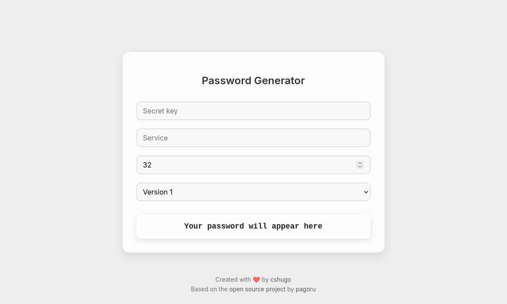

# 🔐 Securia

**Securia** is a clean, minimalist and deterministic password generator built with [Flask](https://flask.palletsprojects.com/).  
It generates strong passwords based on a `secret`, `service`, `version` and `length`, using secure hashing — with no storage, no database, and no tracking.

> Same input → same password every time.

---

## ✨ Features

- 🧠 Deterministic password generation (reproducible)
- 🎨 Smooth color transitions based on password content
- 🔒 Runs locally — no data sent or stored
- 📋 Click-to-copy password
- 🖼️ Modern, responsive and minimal UI
- 🐳 Docker-ready and CasaOS-compatible

---

## 🚀 Quick Start

### ⚙️ Run locally

```bash
git clone https://github.com/cshugo/securia.git
cd securia
pip install -r requirements.txt
python run.py
```

Then open http://localhost:5000

---

### 🐳 Run locally

```bash
docker build -t securia .
docker run -d -p 2801:5000 securia
```
Then open http://localhost:2801

---

### 🏠 Use with CasaOS

1. Copy the included docker-compose.yml and app.json

2. In CasaOS > App Store > Custom App > Add App

3. Paste the contents of app.json or upload it

4. Run:
```bash
docker compose up -d
```

---

### 📸 Screenshots


---

## 🔧 Configuration

| Field     | Description                                     |
|-----------|-------------------------------------------------|
| `secret`  | Your private master password                    |
| `service` | The name of the service (e.g. GitHub, Email)    |
| `length`  | Desired length of the password (default: 32)    |
| `version` | Algorithm version (default: 1, allows rotation) |

---

## ❤️ Credits

Built with ❤️ by [cshugo](https://github.com/cshugo)  
Based on the original concept by [pagoru](https://github.com/pagoru)

---

## 📄 License

This project is licensed under the [MIT License](./LICENSE).
